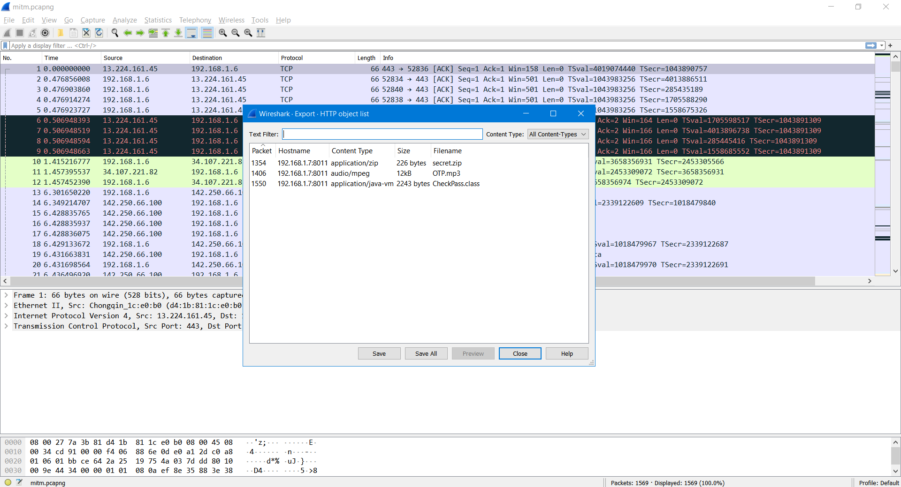

# **mitm.pcapng**

I can find some files that captured by mitm.pcapng with http service:



First part of the flag is in `secret.zip` and its password is spoken in OTP.mp3.

I must admit that it's a little bit hard to hear but I still managed to find out it is `pwd785$`. LOL dollar is dollars or dollar or $.

The first part: `HCMUS-CTF{Just_Network_Stuff_`

The second part is in `CheckPass.class`. I put it on online disassembler for java then I get the source code. I am too lazy to get put it all in here again so I just put it with the solution too

```java
import java.math.BigInteger;
import java.security.MessageDigest;
import java.security.NoSuchAlgorithmException;
import java.util.Scanner;
import java.util.Arrays;


public class CheckPass {
   public static void main(String[] var0) {
      Scanner var2 = new Scanner(System.in);
      System.out.println("Please enter the password!!");
      //char[] punc = {'?','!','[',']','\"',';','.','-'};
      char[]punc={'#','$','^','&'};
      //char []punc={'`',a'|'};
      //char[] punc={'.'};
      int[]arr={0,0,0,0,0,0};
      String var1 = "000000!}";
      for (int z=0;z<punc.length;z++)
        for (int j1=0;j1<10;j1++)
        for (int j2=0;j2<10;j2++)
        for (int j3=0;j3<10;j3++)
        for (int j4=0;j4<10;j4++)
        for (int j5=0;j5<10;j5++)
        {
           arr[0]=j1;
           arr[1]=j2;arr[2]=j3;arr[3]=j4;arr[4]=j5;arr[5]=j1;
           StringBuilder temp=new StringBuilder();

           for (int i = 0; i < arr.length; i++) {
            temp.append(String.valueOf(arr[i]));
        }
        var1=temp.toString()+punc[z]+"}";

            System.out.print(var1);
        if (var1.length() != 8) {
            System.out.println("Oops1!!");
        } else if (!var1.substring(0, 6).matches("[0-9]+")) {
            System.out.println("Oops2!!");
        } else if (!var1.substring(0, 1).equals(var1.substring(5, 6))) {
            System.out.println("Oops3!!");
        } else if (!var1.endsWith("}")) {
            System.out.println("Oops4!!");
        } else {
            String var3 = "(?![@',&])\\p{Punct}";
            if (!var1.substring(6, 7).matches(var3)) {
                System.out.println("Oops5!!");
            } else if (!getMd5(var1).equals("53e443c9f65cd5f816452ae66ec65834")) {                 System.out.println("Oops6!!");
            } else {
                System.out.println("You get the second part!!!");
                return;
            }
        }
    }
    
      var2.close();
   }

   public static String getMd5(String var0) {       
      try {
         MessageDigest var1 = MessageDigest.getInstance("MD5");
         byte[] var2 = var1.digest(var0.getBytes());
         BigInteger var3 = new BigInteger(1, var2);//111511142256443612211284750250686175284

         String var4;
         for(var4 = var3.toString(16); var4.length() < 32; var4 = "0" + var4) {
         }//var4=0..00+var3 length32
         
         return var4;
      } catch (NoSuchAlgorithmException var5) {
         throw new RuntimeException(var5);
      }
   }
}

```

And this password has a rule that 6 first letters are digits then it followed by a punctuation and finished with `}`. 
As you can see, I used bruteforce for my key. Md5 then get `digest()` is unsolvable.

The key is 897268$}


Flag: `HCMUS-CTF{Just_Network_Stuff_897268$}`